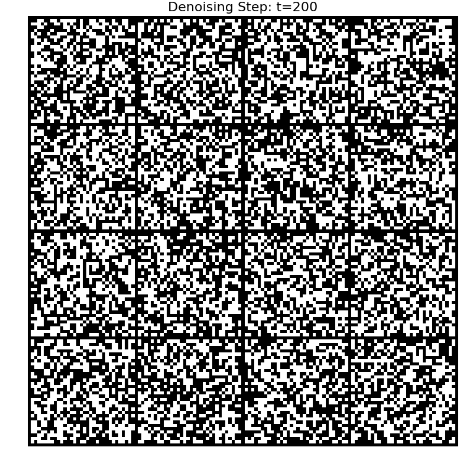

# Discrete Denoising Diffusion Model for MNIST

This repository contains a PyTorch implementation of a **Discrete Denoising Diffusion Probabilistic Model (D3PM)** for generating binarized MNIST digits. The model learns a gradual denoising process to transform random binary noise into recognizable handwritten digits.

This implementation is inspired by the paper "[Structured Denoising Diffusion Models in Discrete State-Spaces](https://arxiv.org/abs/2107.03006)" by Austin et al.

## Denoising Process Visualization

The animation below illustrates the complete reverse diffusion process. Starting from pure random noise (at step T=200), the model iteratively denoises the image at each timestep until a clean, coherent digit emerges (at step t=0).



## Core Concepts

The model is based on a diffusion process defined for discrete data, specifically binary pixels {0, 1} in this case.

### 1. Forward Process (Noising)

The forward process, `q`, gradually corrupts a clean image `x_0` into noise over `T` timesteps. For discrete data, this is defined by a series of **transition matrices** `Q_t`. At each step `t`, a pixel has a probability of flipping its state (0 → 1 or 1 → 0).

-   `q(x_t | x_{t-1})`: This is the one-step transition probability, governed by a small noise value `beta_t`.
-   `q(x_t | x_0)`: The distribution of a noisy image at any timestep `t` given the original image `x_0`. We can sample from this directly using pre-calculated cumulative transition matrices `bar_Q_t`, which makes training efficient.

### 2. Reverse Process (Denoising)

The reverse process, `p`, learns to undo the noising. A **U-Net** model is trained to predict the original image `x_0` from a noisy image `x_t` at a given timestep `t`.

-   **Model Prediction:** The U-Net takes `(x_t, t)` as input and outputs the predicted logits for `x_0`.
-   **Posterior Calculation:** Using the model's prediction of `x_0` and Bayes' theorem, we can calculate the posterior distribution `q(x_{t-1} | x_t, x_0)`. This gives us the probability distribution of the image at the previous, less noisy step.
-   **Sampling:** We sample from this posterior distribution to get `x_{t-1}`. By iterating this process from `t=T` down to `t=0`, we can generate a new image starting from complete noise.

The training objective is to minimize the cross-entropy loss between the model's prediction of `x_0` and the true `x_0`.

## Project Structure

```
.
├── README.md                  # This file
├── dataset.py                 # Handles MNIST data loading, padding, and binarization.
├── diffusion.py               # Core DiscreteDiffusion class for noising, sampling, and loss.
├── model.py                   # U-Net model architecture.
├── train.py                   # Main script for training the model.
├── sample.py                  # Script to generate samples from a trained checkpoint.
└── visualize_denoising.py     # Script to generate a GIF of the denoising process.
```

## Setup

1.  **Clone the repository:**
    ```bash
    git clone https://github.com/demirel99/Discrete_Diffusion_MNIST.git
    cd Discrete_Diffusion_MNIST
    ```

2.  **Install dependencies:**
    It is recommended to use a virtual environment.
    ```bash
    pip install torch torchvision matplotlib tqdm
    ```

## Usage

### 1. Training the Model

Run the training script. The script will automatically download the MNIST dataset. All results, including checkpoints and sample images, will be saved in the `results_d3pm/` directory.

```bash
python train.py
```

Training is configured with the following defaults in `train.py`:
- **Epochs**: 50
- **Batch Size**: 128
- **Timesteps**: 200
- **Learning Rate**: 1e-4

### 2. Generating Samples

Once the model is trained, you can generate a batch of new images using a saved checkpoint.

```bash
# Example using a checkpoint from epoch 50
python sample.py results_d3pm/checkpoints/model_epoch_50.pth
```
You can specify the number of samples to generate with the `--n` flag:
```bash
python sample.py <path_to_checkpoint.pth> --n 16
```

### 3. Visualizing the Denoising Process

To create a GIF like the one above, use the `visualize_denoising.py` script. This will run the full reverse diffusion process and save each step as a frame in the animation.

```bash
# Ensure the timesteps here match the ones used for training
python visualize_denoising.py <path_to_checkpoint.pth> --timesteps 200 --out denoising_process.gif
```

## Reference

> Austin, J., Johnson, D. D., Ho, J., Tarlow, D., & van den Berg, R. (2021). *Structured Denoising Diffusion Models in Discrete State-Spaces*. In Advances in Neural Information Processing Systems. [arXiv:2107.03006](https://arxiv.org/abs/2107.03006).
